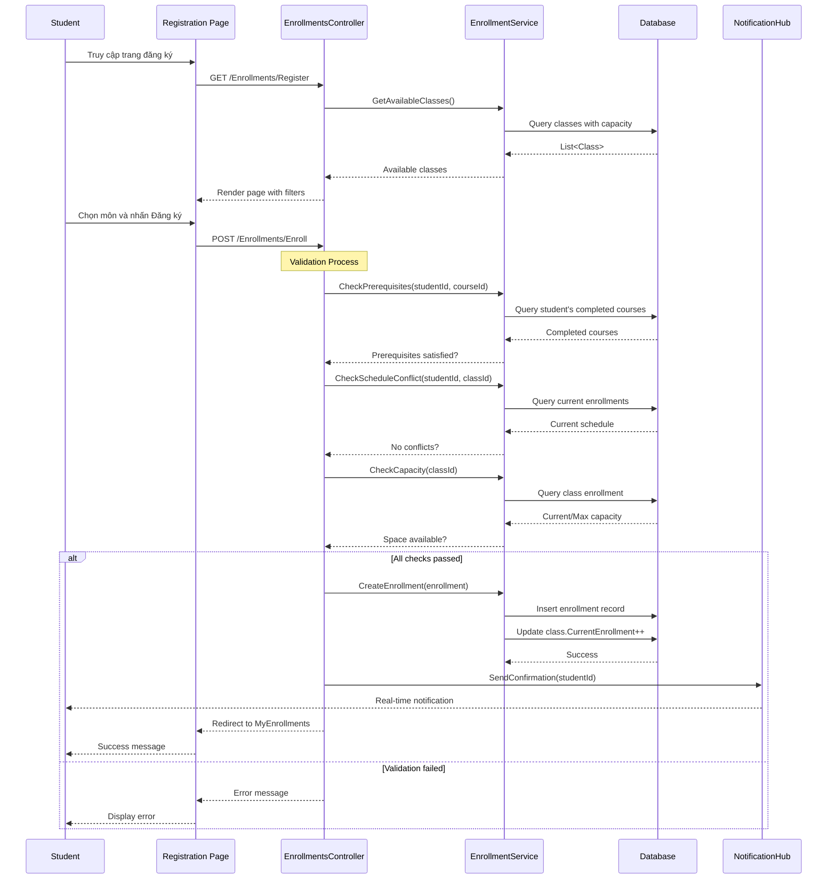
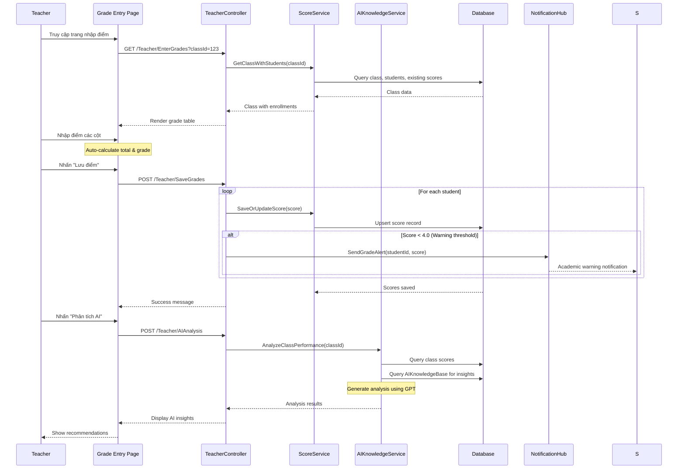
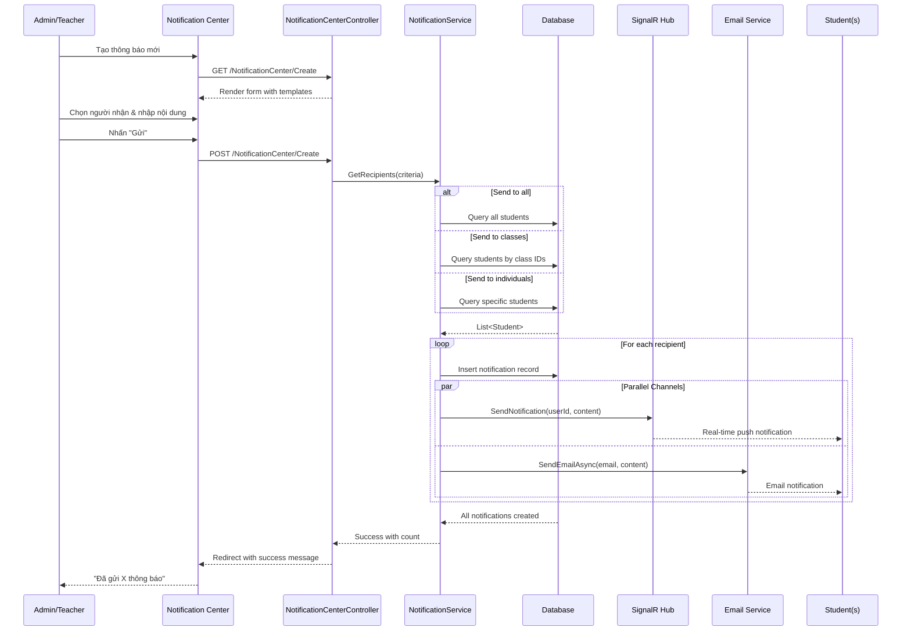
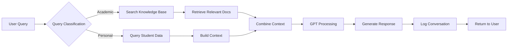

# 📚 Student Management System - TailAdmin UI Overhaul Analysis

## 📋 Mục lục
1. [Tổng quan dự án](#tổng-quan-dự-án)
2. [Cấu trúc thư mục](#cấu-trúc-thư-mục)
3. [Công nghệ sử dụng](#công-nghệ-sử-dụng)
4. [Các Flow chính](#các-flow-chính)
5. [AI Knowledge Base](#ai-knowledge-base)
6. [Hướng dẫn cài đặt](#hướng-dẫn-cài-đặt)
7. [API Endpoints](#api-endpoints)
8. [Cơ sở dữ liệu](#cơ-sở-dữ-liệu)

---

## 🎯 Tổng quan dự án

### Mô tả
Student Management System là hệ thống quản lý sinh viên toàn diện, được thiết kế theo giao diện **TailAdmin** hiện đại. Hệ thống hỗ trợ quản lý:
- Sinh viên và hồ sơ học tập
- Giảng viên và phân công giảng dạy
- Khóa học và đăng ký môn học
- Điểm số và đánh giá
- Thông báo đa kênh
- Phân tích AI tích hợp

### Người dùng mục tiêu
| Role | Chức năng chính |
|------|-----------------|
| **Admin** | Quản trị toàn hệ thống, cấu hình, phân quyền |
| **Teacher** | Quản lý lớp, nhập điểm, gửi thông báo |
| **Student** | Đăng ký môn, xem điểm, nhận thông báo |

### Kiến trúc tổng quan

```
┌─────────────────────────────────────────────────────────────┐
│                    Presentation Layer                        │
│  ┌─────────────┐  ┌─────────────┐  ┌─────────────┐          │
│  │ TailAdmin   │  │   Razor     │  │  SignalR    │          │
│  │    CSS      │  │   Views     │  │    Hub      │          │
│  └─────────────┘  └─────────────┘  └─────────────┘          │
├─────────────────────────────────────────────────────────────┤
│                    Application Layer                         │
│  ┌─────────────┐  ┌─────────────┐  ┌─────────────┐          │
│  │ Controllers │  │  Services   │  │    DTOs     │          │
│  └─────────────┘  └─────────────┘  └─────────────┘          │
├─────────────────────────────────────────────────────────────┤
│                    Domain Layer                              │
│  ┌─────────────┐  ┌─────────────┐  ┌─────────────┐          │
│  │  Entities   │  │ Interfaces  │  │   Enums     │          │
│  └─────────────┘  └─────────────┘  └─────────────┘          │
├─────────────────────────────────────────────────────────────┤
│                    Infrastructure Layer                      │
│  ┌─────────────┐  ┌─────────────┐  ┌─────────────┐          │
│  │    EF       │  │    Repo     │  │   Email     │          │
│  │   Core      │  │  Pattern    │  │  Service    │          │
│  └─────────────┘  └─────────────┘  └─────────────┘          │
├─────────────────────────────────────────────────────────────┤
│                    Database Layer                            │
│  ┌─────────────────────────────────────────────────┐        │
│  │              SQL Server Database                 │        │
│  └─────────────────────────────────────────────────┘        │
└─────────────────────────────────────────────────────────────┘
```

---

## 📁 Cấu trúc thư mục

```
StudentManagementMVC/
├── DataAccess/                    # Data Access Layer
│   ├── AppDbContext.cs            # EF Core Database Context
│   ├── Entities/                  # Domain Entities
│   │   ├── Student.cs
│   │   ├── Teacher.cs
│   │   ├── Course.cs
│   │   ├── Class.cs
│   │   ├── Enrollment.cs
│   │   ├── Score.cs
│   │   ├── Notification.cs
│   │   ├── AIKnowledgeBase.cs     # NEW: AI Knowledge Entity
│   │   ├── AIConversationLog.cs   # NEW: AI Conversation Tracking
│   │   └── DashboardMetric.cs     # NEW: Dashboard Metrics
│   ├── Enums/
│   └── Migrations/
│
├── Services/                      # Business Logic Layer
│   ├── Interfaces/
│   │   ├── IStudentService.cs
│   │   ├── IEnrollmentService.cs
│   │   ├── IScoreService.cs
│   │   └── IAIKnowledgeBaseService.cs  # NEW
│   ├── Implementations/
│   │   ├── StudentService.cs
│   │   ├── EnrollmentService.cs
│   │   ├── ScoreService.cs
│   │   └── AIKnowledgeBaseService.cs   # NEW
│   └── Models/
│       └── AIKnowledgeBaseModels.cs    # NEW
│
├── Repositories/                  # Repository Pattern
│   ├── Interfaces/
│   └── Implementations/
│
├── StudentManagementMVC/          # Presentation Layer
│   ├── Controllers/
│   │   ├── DashboardController.cs
│   │   ├── StudentController.cs   # NEW: Student Dashboard
│   │   ├── TeacherController.cs   # NEW: Teacher Dashboard
│   │   ├── EnrollmentsController.cs
│   │   ├── ScoresController.cs
│   │   ├── AIKnowledgeController.cs    # NEW
│   │   └── NotificationCenterController.cs  # NEW
│   │
│   ├── Views/
│   │   ├── Shared/
│   │   │   ├── _Layout.cshtml
│   │   │   └── _LayoutTailAdmin.cshtml  # NEW: TailAdmin Layout
│   │   ├── Dashboard/
│   │   │   └── IndexTailAdmin.cshtml    # NEW
│   │   ├── Student/
│   │   │   └── Dashboard.cshtml         # NEW
│   │   ├── Teacher/
│   │   │   ├── Dashboard.cshtml         # NEW
│   │   │   └── EnterGrades.cshtml       # NEW
│   │   ├── AIKnowledge/
│   │   │   ├── Index.cshtml             # NEW
│   │   │   └── Create.cshtml            # NEW
│   │   └── NotificationCenter/
│   │       ├── Index.cshtml             # NEW
│   │       └── Create.cshtml            # NEW
│   │
│   ├── wwwroot/
│   │   ├── css/
│   │   │   ├── tailadmin.css            # NEW: TailAdmin Styles
│   │   │   └── dashboard.css            # NEW: Dashboard Specific
│   │   ├── js/
│   │   └── images/
│   │
│   ├── Hubs/
│   │   └── NotificationHub.cs
│   │
│   └── Program.cs
```

---

## 🛠 Công nghệ sử dụng

### Backend
| Technology | Version | Purpose |
|------------|---------|---------|
| ASP.NET Core MVC | 8.0 | Web Framework |
| Entity Framework Core | 8.0 | ORM |
| SQL Server | 2019+ | Database |
| SignalR | 8.0 | Real-time Communication |
| Azure OpenAI | Latest | AI Integration |

### Frontend
| Technology | Purpose |
|------------|---------|
| TailAdmin CSS | Custom styling (TailwindCSS-inspired) |
| Chart.js | Data Visualization |
| Font Awesome | Icons |
| SignalR Client | Real-time Notifications |

### CSS Variables (TailAdmin Theme)
```css
:root {
    /* Brand Colors */
    --brand-500: #465fff;
    --brand-600: #3347dc;
    
    /* Semantic Colors */
    --success-500: #10b981;
    --warning-500: #f59e0b;
    --error-500: #ef4444;
    
    /* Neutral Colors */
    --gray-100: #f3f4f6;
    --gray-500: #6b7280;
    --gray-900: #111827;
    
    /* Typography */
    --font-family: 'Inter', -apple-system, sans-serif;
    
    /* Spacing */
    --radius-lg: 12px;
    --radius-xl: 16px;
}
```

---

## 🔄 Các Flow chính

### Flow 1: Đăng ký môn học (Student Registration)



#### Tính năng nổi bật:
- ✅ Kiểm tra môn tiên quyết tự động
- ✅ Phát hiện trùng lịch học
- ✅ Hiển thị số lượng chỗ còn trống real-time
- ✅ Gợi ý môn học từ AI dựa trên lịch sử học tập
- ✅ Gửi email xác nhận đăng ký
- ✅ Thông báo real-time qua SignalR

---

### Flow 2: Nhập điểm và phân tích AI (Grade Entry + AI Analysis)



#### Công thức tính điểm (theo quy định FPT):
```
Total = Attendance × 10% + Assignment1 × 10% + Assignment2 × 10% + Midterm × 20% + Final × 50%

Grade Mapping:
- A: 8.5 - 10.0 (Xuất sắc)
- B: 7.0 - 8.4 (Giỏi)
- C: 5.5 - 6.9 (Khá)
- D: 4.0 - 5.4 (Trung bình)
- F: 0.0 - 3.9 (Không đạt)
```

#### AI Analysis Features:
- 📊 Thống kê tỷ lệ đậu/rớt
- 🎯 Phát hiện sinh viên cần hỗ trợ
- 💡 Gợi ý phương pháp cải thiện
- 📈 So sánh với các kỳ trước
- 🔔 Tự động gửi cảnh báo học vụ

---

### Flow 3: Thông báo đa kênh (Multi-channel Notifications)



#### Notification Types:
| Type | Icon | Use Case |
|------|------|----------|
| Info | ℹ️ | Thông tin chung |
| Warning | ⚠️ | Cảnh báo, nhắc nhở |
| Success | ✅ | Xác nhận thành công |
| Error | ❌ | Lỗi, vấn đề |
| Academic | 🎓 | Học vụ, điểm số |
| System | ⚙️ | Hệ thống |

#### Priority Levels:
- `0` - Normal (Bình thường)
- `1` - Important (Quan trọng) - Hiển thị badge
- `2` - Urgent (Khẩn cấp) - Push notification ngay

---

## 🤖 AI Knowledge Base

### Mô tả
AI Knowledge Base là hệ thống lưu trữ kiến thức để AI sử dụng khi:
- Phân tích kết quả học tập sinh viên
- Đề xuất lộ trình học tập
- Tư vấn đăng ký môn học
- Giải đáp thắc mắc về quy định

### Entity Structure

```csharp
public class AIKnowledgeBase
{
    public int Id { get; set; }
    public string Title { get; set; }        // Tiêu đề bài viết
    public string Content { get; set; }       // Nội dung chi tiết
    public string Category { get; set; }      // Danh mục
    public string Tags { get; set; }          // Tags phân tách bằng dấu phẩy
    public int Priority { get; set; }         // Độ ưu tiên (1-10)
    public int UsageCount { get; set; }       // Số lần sử dụng
    public bool IsActive { get; set; }        // Trạng thái hoạt động
    public string Language { get; set; }      // Ngôn ngữ (vi, en)
    public string MetadataJson { get; set; }  // Metadata bổ sung
    public DateTime CreatedAt { get; set; }
    public DateTime? UpdatedAt { get; set; }
}
```

### Danh mục Knowledge (~200 items)

| Category | Số lượng | Mô tả |
|----------|----------|-------|
| `Quy định học vụ` | 30 | Quy chế, quy định của trường |
| `Chương trình đào tạo` | 25 | Khung chương trình, môn học |
| `Môn học chi tiết` | 50 | Mô tả chi tiết từng môn |
| `Phương pháp học tập` | 25 | Tips, kỹ năng học hiệu quả |
| `Hướng dẫn đăng ký` | 20 | Quy trình đăng ký môn |
| `Quy định điểm số` | 15 | Cách tính điểm, GPA |
| `Câu hỏi thường gặp` | 35 | FAQ phổ biến |

### AI Processing Flow



### Sample Knowledge Items

```json
[
  {
    "title": "Quy định tính điểm GPA theo hệ 10",
    "category": "Quy định điểm số",
    "content": "GPA được tính theo công thức: GPA = Σ(Điểm môn × Tín chỉ) / Σ Tín chỉ. Điểm từng môn được tính theo công thức: Chuyên cần (10%) + Bài tập 1 (10%) + Bài tập 2 (10%) + Giữa kỳ (20%) + Cuối kỳ (50%)...",
    "tags": "GPA, điểm số, quy định, tính điểm",
    "priority": 10
  },
  {
    "title": "Môn tiên quyết ngành Công nghệ thông tin",
    "category": "Chương trình đào tạo",
    "content": "Để học PRO192 (Lập trình Java), sinh viên cần hoàn thành PRF192 (Lập trình cơ bản). Để học SWP391 (Dự án phần mềm), sinh viên cần hoàn thành PRO192 và SWR302...",
    "tags": "môn tiên quyết, CNTT, lập trình",
    "priority": 8
  }
]
```

---

## 🚀 Hướng dẫn cài đặt

### Yêu cầu hệ thống
- .NET 8.0 SDK
- SQL Server 2019+
- Node.js 18+ (cho frontend tools)
- Visual Studio 2022 hoặc VS Code

### Các bước cài đặt

```bash
# 1. Clone repository
git clone https://github.com/your-repo/StudentManagementMVC.git
cd StudentManagementMVC

# 2. Restore packages
dotnet restore

# 3. Cập nhật connection string trong appsettings.json
# "ConnectionStrings": {
#     "DefaultConnection": "Server=.;Database=StudentManagementDB;Trusted_Connection=true;TrustServerCertificate=true"
# }

# 4. Chạy migrations
cd StudentManagementMVC
dotnet ef database update

# 5. Seed dữ liệu ban đầu (bao gồm AI Knowledge Base)
# Truy cập: https://localhost:5001/Seed/All

# 6. Chạy ứng dụng
dotnet run
```

### Cấu hình Azure OpenAI (tùy chọn)

```json
// appsettings.json
{
  "AzureOpenAI": {
    "Endpoint": "https://your-resource.openai.azure.com/",
    "ApiKey": "your-api-key",
    "DeploymentName": "gpt-4",
    "MaxTokens": 2000
  }
}
```

---

## 🔗 API Endpoints

### Authentication
| Method | Endpoint | Description |
|--------|----------|-------------|
| POST | `/Auth/Login` | Đăng nhập |
| POST | `/Auth/Logout` | Đăng xuất |
| GET | `/Auth/Profile` | Xem profile |

### Student APIs
| Method | Endpoint | Description |
|--------|----------|-------------|
| GET | `/Student/Dashboard` | Student landing page |
| GET | `/Enrollments/Register` | Trang đăng ký môn |
| POST | `/Enrollments/Enroll` | Đăng ký môn học |
| GET | `/Enrollments/MyEnrollments` | Danh sách đã đăng ký |
| GET | `/Scores/MyGrades` | Bảng điểm cá nhân |

### Teacher APIs
| Method | Endpoint | Description |
|--------|----------|-------------|
| GET | `/Teacher/Dashboard` | Teacher landing page |
| GET | `/Teacher/MyClasses` | Danh sách lớp dạy |
| GET | `/Teacher/EnterGrades/{classId}` | Trang nhập điểm |
| POST | `/Teacher/SaveGrades` | Lưu điểm |
| GET | `/Teacher/ClassDetail/{id}` | Chi tiết lớp |

### Admin APIs
| Method | Endpoint | Description |
|--------|----------|-------------|
| GET | `/Dashboard/IndexTailAdmin` | Admin dashboard |
| GET | `/AIKnowledge` | Quản lý Knowledge Base |
| POST | `/AIKnowledge/Create` | Thêm knowledge item |

### Notification APIs
| Method | Endpoint | Description |
|--------|----------|-------------|
| GET | `/NotificationCenter` | Danh sách thông báo |
| POST | `/NotificationCenter/Create` | Gửi thông báo mới |
| POST | `/NotificationCenter/MarkAsRead/{id}` | Đánh dấu đã đọc |
| POST | `/NotificationCenter/MarkAllAsRead` | Đánh dấu tất cả đã đọc |
| GET | `/NotificationCenter/GetUnreadCount` | Đếm thông báo chưa đọc |

---

## 🗄️ Cơ sở dữ liệu

### Entity Relationship Diagram

```
┌──────────────┐     ┌──────────────┐     ┌──────────────┐
│    User      │     │   Student    │     │   Teacher    │
├──────────────┤     ├──────────────┤     ├──────────────┤
│ Id           │◄───┐│ Id           │     │ Id           │
│ Username     │    ││ UserId       │────►│ UserId       │────►
│ Password     │    ││ StudentCode  │     │ TeacherCode  │
│ Email        │    ││ ClassCode    │     │ Department   │
│ FullName     │    ││ Major        │     │ FullName     │
│ Role         │    ││ GPA          │     └──────────────┘
└──────────────┘    │└──────────────┘            │
                    │       │                     │
                    │       │                     │
┌──────────────┐    │       ▼                     ▼
│   Course     │    │┌──────────────┐     ┌──────────────┐
├──────────────┤    ││ Enrollment   │     │    Class     │
│ Id           │◄──┐│├──────────────┤     ├──────────────┤
│ CourseCode   │   │││ EnrollmentId │     │ Id           │
│ CourseName   │   │││ StudentId    │────►│ ClassCode    │
│ Credits      │   │││ ClassId      │────►│ CourseId     │────►
│ Prerequisites│   │││ Status       │     │ TeacherId    │────►
└──────────────┘   │││ Grade        │     │ SemesterId   │
                   ││└──────────────┘     │ MaxCapacity  │
                   ││       │             │ Schedule     │
                   ││       ▼             └──────────────┘
                   ││┌──────────────┐
                   │││    Score     │
                   ││├──────────────┤
                   │││ Id           │
                   │││ StudentId    │────►
                   │││ ClassId      │────►
                   │││ Attendance   │
                   │││ Assignment1  │
                   │││ Assignment2  │
                   │││ Midterm      │
                   │││ FinalExam    │
                   │││ TotalScore   │
                   ││└──────────────┘
                   ││
┌──────────────┐   ││┌──────────────┐     ┌──────────────────┐
│ Notification │   │││AIKnowledge  │     │AIConversationLog │
├──────────────┤   ││├──────────────┤     ├──────────────────┤
│ Id           │   │││ Id           │     │ Id               │
│ Title        │   │││ Title        │     │ RequestType      │
│ Message      │   │││ Content      │     │ Prompt           │
│ Type         │   │││ Category     │     │ Response         │
│ StudentId    │───┘││ Tags         │     │ UsedKnowledgeIds │
│ TeacherId    │────┘│ Priority     │     │ TokensUsed       │
│ IsRead       │     │ UsageCount   │     │ StudentId        │
│ CreatedAt    │     │ IsActive     │     │ CreatedAt        │
└──────────────┘     └──────────────┘     └──────────────────┘
```

### Bảng mới thêm

#### AIKnowledgeBase
```sql
CREATE TABLE AIKnowledgeBase (
    Id INT IDENTITY(1,1) PRIMARY KEY,
    Title NVARCHAR(500) NOT NULL,
    Content NVARCHAR(MAX) NOT NULL,
    Category NVARCHAR(100) NOT NULL,
    Tags NVARCHAR(500),
    Priority INT DEFAULT 5,
    UsageCount INT DEFAULT 0,
    IsActive BIT DEFAULT 1,
    Language NVARCHAR(10) DEFAULT 'vi',
    MetadataJson NVARCHAR(MAX),
    CreatedAt DATETIME2 DEFAULT GETDATE(),
    UpdatedAt DATETIME2
);

CREATE INDEX IX_AIKnowledgeBase_Category ON AIKnowledgeBase(Category);
CREATE INDEX IX_AIKnowledgeBase_IsActive ON AIKnowledgeBase(IsActive);
```

#### AIConversationLog
```sql
CREATE TABLE AIConversationLog (
    Id INT IDENTITY(1,1) PRIMARY KEY,
    RequestType NVARCHAR(100) NOT NULL,
    Prompt NVARCHAR(MAX) NOT NULL,
    Response NVARCHAR(MAX),
    UsedKnowledgeIds NVARCHAR(500),
    ModelUsed NVARCHAR(100),
    TokensUsed INT,
    ProcessingTime INT, -- milliseconds
    Status NVARCHAR(50),
    StudentId INT FOREIGN KEY REFERENCES Students(Id),
    TeacherId INT FOREIGN KEY REFERENCES Teachers(Id),
    CreatedAt DATETIME2 DEFAULT GETDATE()
);
```

#### DashboardMetric
```sql
CREATE TABLE DashboardMetric (
    Id INT IDENTITY(1,1) PRIMARY KEY,
    MetricName NVARCHAR(100) NOT NULL,
    MetricKey NVARCHAR(50) NOT NULL,
    CurrentValue DECIMAL(18,2) NOT NULL,
    PreviousValue DECIMAL(18,2),
    ChangePercentage DECIMAL(5,2),
    Trend NVARCHAR(20), -- Up, Down, Stable
    Category NVARCHAR(50),
    Period NVARCHAR(20), -- Daily, Weekly, Monthly, Semester
    CalculatedAt DATETIME2 DEFAULT GETDATE()
);
```

---

## 📊 Dashboard Metrics

### Admin Dashboard
| Metric | Query | Update Frequency |
|--------|-------|------------------|
| Tổng sinh viên | `COUNT(Students)` | Real-time |
| Sinh viên hoạt động | `COUNT(Students WHERE Status='Active')` | Daily |
| Tổng giảng viên | `COUNT(Teachers)` | Real-time |
| Tổng môn học | `COUNT(Courses)` | Real-time |
| Lớp học kỳ này | `COUNT(Classes WHERE SemesterId=current)` | Real-time |
| Đăng ký hôm nay | `COUNT(Enrollments WHERE Date=today)` | Hourly |
| GPA trung bình | `AVG(Students.GPA)` | Daily |
| Tỷ lệ đậu | `COUNT(Passed)/COUNT(Total)` | Per semester |

### Student Dashboard
| Metric | Description |
|--------|-------------|
| GPA tổng kết | GPA tích lũy toàn khóa |
| Tín chỉ hoàn thành | Tổng tín chỉ đã đạt |
| Môn đang học | Số môn đăng ký kỳ này |
| Phân bố điểm | Chart A/B/C/D/F |
| Lịch học hôm nay | Các lớp có trong ngày |
| Điểm gần đây | 5 môn có điểm mới nhất |

### Teacher Dashboard
| Metric | Description |
|--------|-------------|
| Lớp đang dạy | Số lớp được phân công |
| Tổng sinh viên | Số SV trong các lớp |
| Lớp hôm nay | Số tiết dạy trong ngày |
| Phân bố điểm SV | Chart điểm các lớp |
| SV cần lưu ý | SV có điểm thấp |
| Lớp chưa nhập điểm | Reminder nhập điểm |

---

## 🎨 UI Components (TailAdmin)

### Card Components
```html
<!-- Stat Card -->
<div class="stat-card">
    <div class="stat-card-header">
        <div class="stat-card-icon students">
            <i class="fas fa-user-graduate"></i>
        </div>
    </div>
    <div class="stat-card-body">
        <div class="stat-card-value">1,234</div>
        <div class="stat-card-label">Sinh viên</div>
    </div>
    <div class="stat-card-footer">
        <span class="trend-up">+12%</span> so với kỳ trước
    </div>
</div>

<!-- Chart Card -->
<div class="chart-card">
    <div class="chart-card-header">
        <div class="chart-card-title">Thống kê điểm</div>
    </div>
    <div class="chart-card-body">
        <canvas id="gradeChart"></canvas>
    </div>
</div>

<!-- Alert Card -->
<div class="alert-card warning">
    <div class="alert-card-icon">
        <i class="fas fa-exclamation-triangle"></i>
    </div>
    <div class="alert-card-content">
        <div class="alert-card-title">Cảnh báo</div>
        <div class="alert-card-description">Nội dung cảnh báo</div>
    </div>
</div>
```

### Form Elements
```html
<!-- Modern Input -->
<div class="form-group">
    <label class="form-label">Email</label>
    <input type="email" class="form-control" placeholder="Enter email">
</div>

<!-- Select -->
<select class="form-control">
    <option>Option 1</option>
    <option>Option 2</option>
</select>

<!-- Buttons -->
<button class="btn btn-brand">Primary</button>
<button class="btn btn-secondary">Secondary</button>
<button class="btn btn-ghost">Ghost</button>
```

---

## 📝 Changelog

### Version 2.0.0 (Current)
- ✅ Hoàn thành giao diện TailAdmin
- ✅ Thêm AI Knowledge Base (200 items)
- ✅ Student Dashboard với metrics chi tiết
- ✅ Teacher Dashboard với grade entry
- ✅ Notification Center với real-time
- ✅ 3 flows chính hoàn chỉnh

### Coming Soon
- 🔄 Mobile responsive optimization
- 🔄 Dark mode toggle
- 🔄 Export reports to PDF
- 🔄 Advanced AI chatbot
- 🔄 Calendar integration

---

## 👥 Đóng góp

Dự án được phát triển bởi team sinh viên FPT University.

### Contributors
- Lead Developer
- UI/UX Designer  
- Backend Developer
- QA Tester

---

## 📄 License

MIT License - Free to use for educational purposes.

---

*Tài liệu được tạo tự động bởi AI Assistant - Cập nhật lần cuối: @DateTime.Now.ToString("dd/MM/yyyy")*
